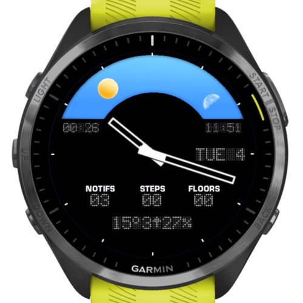

# SunWatchFace

A Garmin Connect IQ watch face that visualizes the sun and moon's position in
the sky throughout the day and night, alongside an analog time display and
LED-style data readouts.

## Features

- **Sun & moon arc** — a sun icon and moon-phase glyph sweep across a sky
  band above the watch face, tracking their real position based on the
  device's location and today's sunrise/sunset times. The moon's position and
  phase are approximated from the current lunar cycle (no full ephemeris).
- **Day/night background** — the sky graphic switches between a day and
  night image depending on whether the sun is currently up.
- **Analog hands** — hour and minute hands rendered with a soft drop shadow.
- **LED-style data fields**:
  - Current weather (temperature, wind speed/direction, rain chance), from
    the device's weather API
  - Next sun/moon rise and set time
  - Step count and (on supported devices) floors climbed
  - Notification count
  - Day and date
  - An optional alternate timezone clock
- **Configurable alternate timezone** — pick a second UTC offset to display
  from the watch face settings.

## Supported devices

Defined in [manifest.xml](manifest.xml):

- Forerunner 965 (`fr965`)
- Venu 3 (`venu3`)
- vivoactive 5 (`vivoactive5`)

Layouts are shared between round 454×454 devices (fr965, venu3) and the
390×390 vivoactive 5, with device-specific annotations (`Round454` /
`Round390`) selecting the right positions, radii, and clip heights per
screen size (see [monkey.jungle](monkey.jungle) and
[SunWatchFaceView.mc](source/SunWatchFaceView.mc)).

## Requires

- `Positioning` permission, to compute local sunrise/sunset and drive the
  sun/moon arc.
- Weather data (via `Toybox.Weather`) for the temperature/wind/rain readout
  and for sunrise/sunset lookups.

## Building

This is a [Garmin Connect IQ](https://developer.garmin.com/connect-iq/overview/)
Monkey C project. To build and run it:

1. Install the [Connect IQ SDK](https://developer.garmin.com/connect-iq/sdk/)
   and the [Monkey C extension for VS Code](https://developer.garmin.com/connect-iq/monkey-c/).
2. Open this folder in VS Code.
3. Use the "Monkey C: Build Current Project" / "Monkey C: Run" commands, or
   `monkeyc`/`connectiq` CLI tools, targeting one of the products listed in
   `manifest.xml`.
4. To install on a physical device, build a `.prg`/`.iq` package and sideload
   it via Garmin Express or by copying it to the device's `GARMIN/APPS`
   directory.